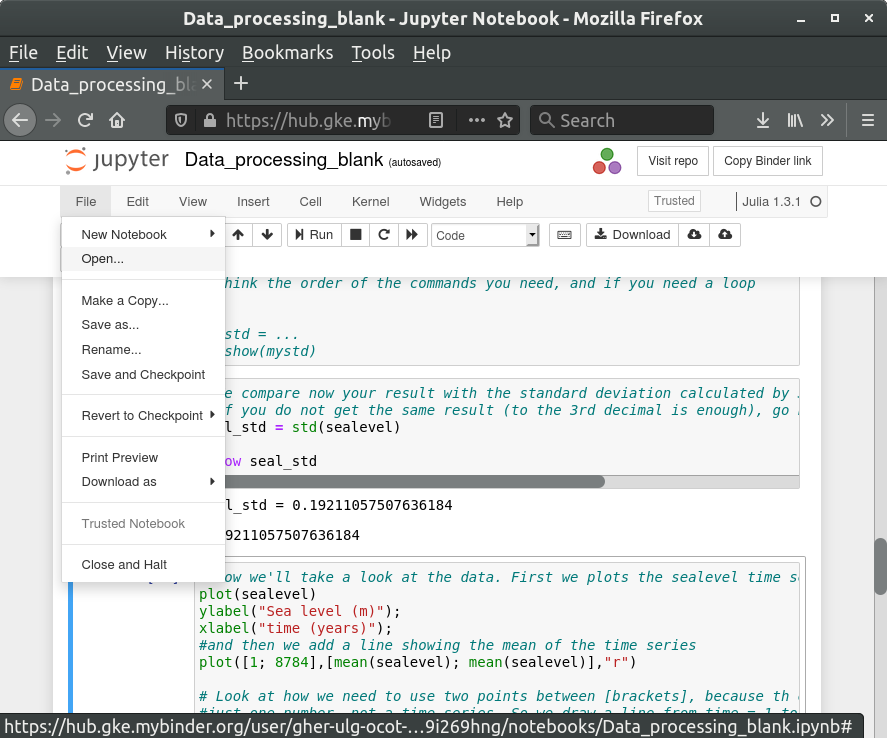
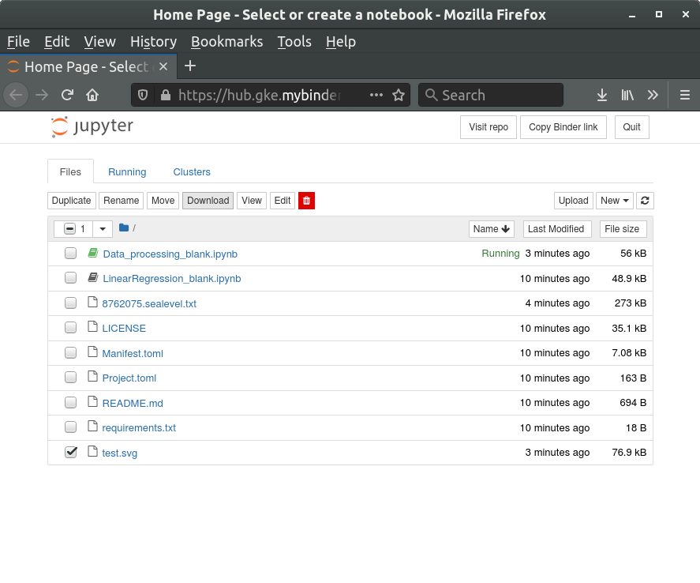

# Coastal Oceanography

Click on the "launch binder" icon to start the notebooks. Setting-up the working environement on the binder service can take a couple of minutes. Binder will automatically shut down user sessions that have more than 10 minutes of inactivity.

* Data processing 

* Linear regression 

* Air-Sea heat fluxes 

## Downloading

To download a file (like a figure), select `File -> Open...` in the menu. This opens a new window with a file manager. Tick the check-box of the file and select `Download`.

More information about Binder is available in the [Binder FAQ](https://mybinder.readthedocs.io/en/latest/faq.html).
